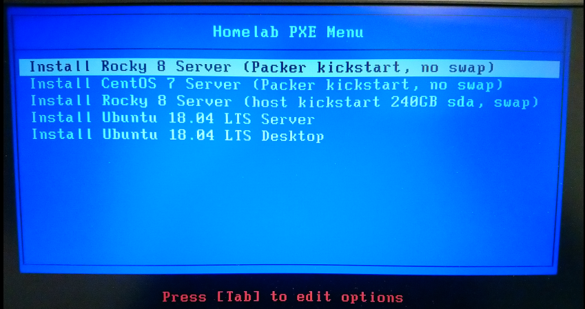
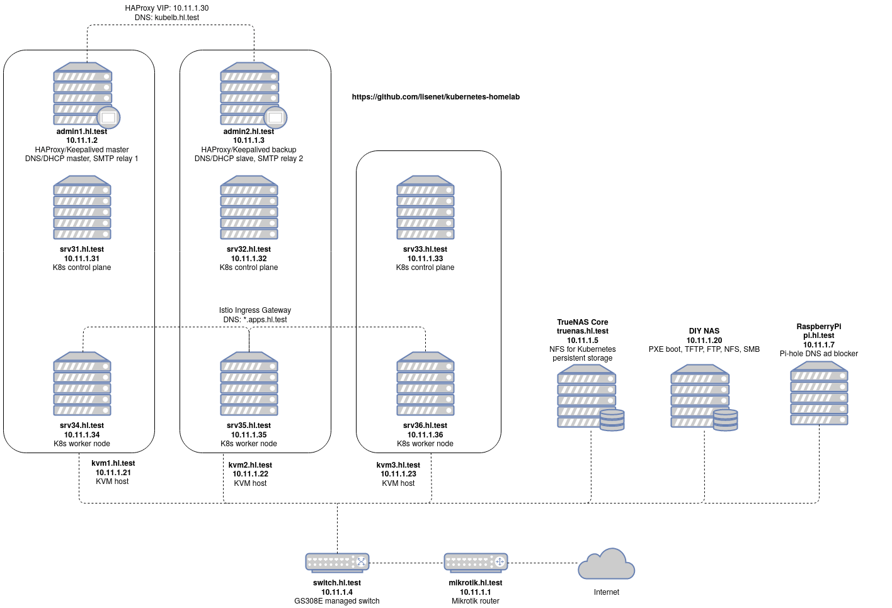

# homelab-ansible

Ansible infrastructure for my homelab.

[](https://github.com/lisenet/homelab-ansible/blob/master/README.md#version-table)
[](https://github.com/lisenet/homelab-ansible/blob/master/README.md#version-table)
[](https://github.com/lisenet/homelab-ansible/blob/master/LICENSE)
[](https://github.com/lisenet/homelab-ansible/commits/master)
[](https://github.com/lisenet/homelab-ansible/commits/master)
[](https://github.com/lisenet/homelab-ansible/issues)
[](https://github.com/lisenet/homelab-ansible/pulls)

## Version Table

Software versions used by this repository:

| Package        | Version   |
| -------------- | --------- |
| ansible        | 9.13.0    |
| ansible-core   | 2.16.14   |
| ansible-lint   | 25.6.1    |
| python         | 3.11      |

## Install Ansible

This repository uses Ansible version that requires Python 3.11.

Install required packages.

Use `apt` for Debian based systems:

```bash
sudo apt install -y python3.11 python3.11-pip
```

Use `yum` for Red Hat based systems:

```bash
sudo yum install -y python3.11 python3.11-pip python3.11-netaddr
```

Use `pip` in your selected Python environment to install the Ansible package of your choice for the current user:

```bash
TMPDIR="${HOME}/tmp" python3.11 -m pip install --user ansible==9.13.0 passlib
```

### Optional: Ansible-lint and pre-commit

Ansible Lint is a command-line tool for linting playbooks, roles and collection.

Note that `ansible-core` 2.12+ was made as a direct dependency with Ansible Lint release v6.0.0. This means that when you install the `ansible-lint` package >=v6.0.0, it also installs `ansible-core` and `ansible` packages as dependencies.
Package `yamllint` is installed as a dependency as well.

Install packages:

```bash
python3.11 -m pip install --user ansible-lint==25.6.1
```

To use Ansible-lint with pre-commit, use the following command to create a pre-commit configuration file:

```bash
cat <<EOF > .pre-commit-config.yaml
- repo: https://github.com/ansible/ansible-lint
  rev: v25.6.1
  hooks:
    - id: ansible-lint
      files: \.(yaml|yml)$
EOF
```

Install `pre-commit` package:

```bash
python3.11 -m pip install --user pre-commit==3.3.3
```

Enable pre-commit for the git repository:

```bash
pre-commit install
```

## Passwordless SSH Authentication

Servers built with Kickstart/Packer have root SSH keys pre-configured. If that is not the case, then see below.

Configure passwordless root SSH authentication from the device where Ansible is installed (e.g. your laptop):

```bash
ssh-copy-id -f -i ./roles/hl.users/files/id_rsa_root.pub root@10.11.1.XX
```

## Set Ansible User Password

Create a file `vault.key` to store your Ansible Vault secret (see `ansible.cfg` for vault_password_file). Use Ansible Vault to create an encrypted file `./roles/hl.users/defaults/secure.yml` to store your user password:

```bash
ansible-vault create ./roles/hl.users/defaults/secure.yml
```

The variable for user password is `user_password`.

## Configuration with Ansible

### Configure PXE Hosts

```bash
ansible-playbook ./playbooks/configure-pxe-hosts.yml --extra-vars "download_pxe_boot_media=true download_packer_media=true"
```

### Configure KVM Hosts

```bash
ansible-playbook ./playbooks/configure-kvm-hosts.yml
```

### Configure Admin Hosts

```bash
ansible-playbook ./playbooks/configure-admin-hosts.yml
```

### Configure Kubernetes Hosts

Prepare Kubernetes hosts for cluster deployment:

```bash
ansible-playbook ./playbooks/configure-k8s-hosts.yml
```

Configure Kubernetes cluster for the first time:

```bash
ansible-playbook ./playbooks/configure-k8s-cluster.yml
```

### Configure OpenVAS Hosts

```bash
ansible-playbook ./playbooks/configure-openvas-hosts.yml
```

### Configure Dell Hosts

```bash
ansible-playbook ./playbooks/configure-dell-hosts.yml
```

### Optional: Configure Hosts File

This is optional because of the local DNS server:

```bash
ansible-playbook ./playbooks/configure-hostsfile.yml
```

### Optional: Configure New Relic Agent

```bash
ansible-playbook ./playbooks/configure-newrelic-hosts.yml
```

## Ansible-configured PXE Boot Server

Note that user password for PXE boot Kickstart files is set to `packer`.




## Homelab Network Diagram


