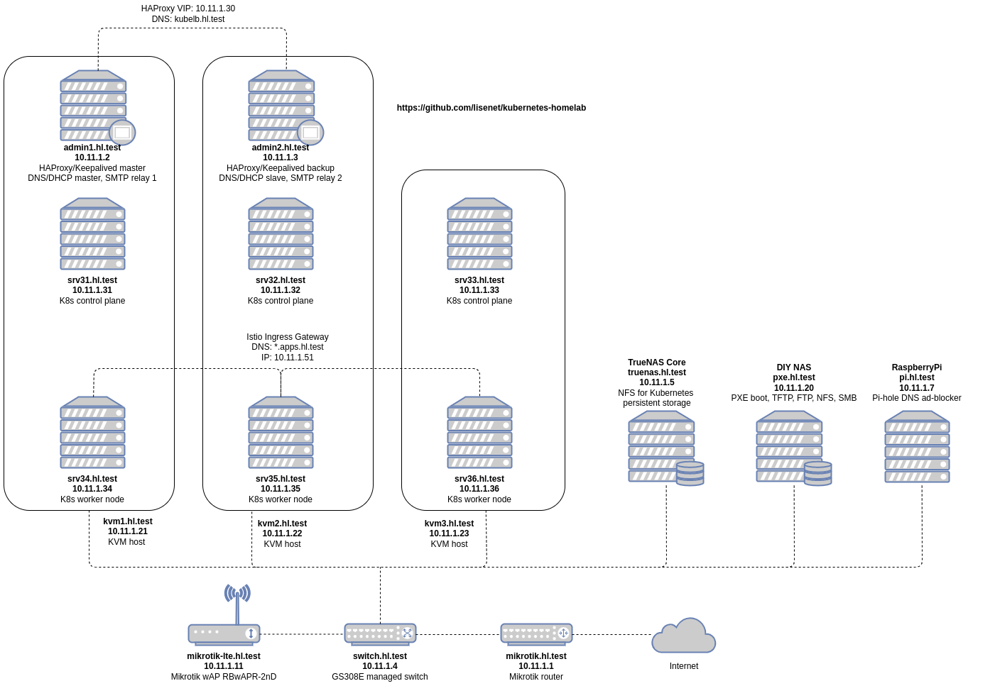

# homelab-ansible

Ansible infrastructure for my homelab.

[](https://github.com/lisenet/homelab-ansible/blob/master/VERSIONS.md)
[](https://github.com/lisenet/homelab-ansible/blob/master/LICENSE)
[](https://github.com/lisenet/homelab-ansible/commits/master)
[](https://github.com/lisenet/homelab-ansible/commits/master)
[](https://github.com/lisenet/homelab-ansible/issues)
[](https://github.com/lisenet/homelab-ansible/pulls)

## Install Ansible

```
sudo apt-get -y install python3 python3-pip
python -m pip install --user ansible
```

The following collections are required to be installed:

```
ansible-galaxy collection install ansible.posix -p ./collections
ansible-galaxy collection install community.general -p ./collections
```

## Passwordless SSH Authentication

Servers built with Kickstart/Packer have root SSH keys pre-configured. If that is not the case, then see below.

Configure passwordless root SSH authentication from the device where Ansible is installed (e.g. your laptop):

```
ssh-copy-id -f -i ./roles/hl.users/files/id_rsa_root.pub root@10.11.1.XX
```

## Configuration with Ansible

### Configure PXE Hosts

```
ansible-playbook ./playbooks/configure-pxe-hosts.yml
```

### Configure KVM Hosts

```
ansible-playbook ./playbooks/configure-kvm-hosts.yml
```

### Configure Admin Hosts

```
ansible-playbook ./playbooks/configure-admin-hosts.yml
```

### Configure Kubernetes Hosts

```
ansible-playbook ./playbooks/configure-k8s-hosts.yml
```

### Optional: Configure New Relic Agent

```
ansible-playbook ./playbooks/configure-newrelic-hosts.yml
```

## Homelab Network Diagram


